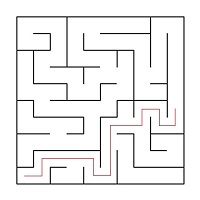
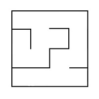
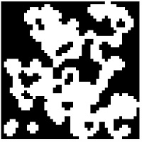
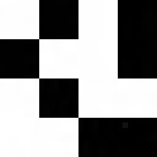

# Maze

*Проект в разработке

## Введение

В данном проекте реализованы лабиринты и пещеры, а также основные алгоритмы их обработки, такие как: генерация, отрисовка, поиск решения.

## Информация

Лабиринт с «тонкими стенками» представляет собой таблицу размером _n_ строк на _m_ стофлбцов. 
Между ячейками таблицы могут находиться «стены». Также «стенами» окружена вся таблица в целом. 

Далее приведён пример такого лабиринта: \


Решением лабиринта считается кратчайший путь от заданной начальной точки (ячейки таблицы) до конечной. 
При прохождении лабиринта можно передвигаться к соседним ячейкам, не отделенным «стеной» от текущей ячейки и находящимся сверху, снизу, справа или слева. 
Кратчайшим маршрут считается, если он проходит через наименьшее число ячеек.

Пример лабиринта с его решением: \


В этом примере начальная точка задана, как 10; 1, а конечная, как 6; 10.

## Описание лабиринта

Лабиринт может храниться в файле в виде количества строк и столбцов, а также двух матриц, содержащих положение вертикальных и горизонтальных стен соответственно. 
В первой матрице отображается наличие стены справа от каждой ячейки, а во второй - снизу. 

Пример подобного файла:  
```
4 4
0 0 0 1
1 0 1 1
0 1 0 1
0 0 0 1

1 0 1 0
0 0 1 0
1 1 0 1
1 1 1 1
```

Лабиринт, описанный в этом файле: \


## Недостатки лабиринтов

К недостаткам лабиринтов относятся изолированные области и петли.

Изолированная область - это часть лабиринта с проходами, в которые нельзя попасть из оставшейся части лабиринта. Например: \


Петля - это часть лабиринта с проходами, по которым можно ходить «кругами». Стены в петлях не соединены со стенами, окружающими лабиринт. Например: \


## Генерация с использованием клеточного автомата

Во многих играх есть необходимость в ветвящихся локациях, например пещерах. 
Такие локации могут быть созданы генерацией с использованием клеточного автомата. 
При подобной генерации используется идея, схожая с игрой «Жизнь». 
Суть предложенного алгоритма состоит в реализации всего двух шагов: 
сначала все поле заполняется случайным образом стенами — т.е. для каждой клетки случайным образом определяется, 
будет ли она свободной или непроходимой — а затем несколько раз происходит обновление состояния карты в соответствии с условиями, похожими на условия рождения/смерти в «Жизни».

Правила проще, чем в «Жизни» - есть две специальные переменные, одна для «рождения» «мертвых» клеток (предел «рождения») и одна для уничтожения «живых» клеток (предел «смерти»). 
Если «живые» клетки окружены «живыми» клетками, количество которых меньше, чем предел «смерти», они «умирают». 
Аналогично если «мертвые» клетки находятся рядом с «живыми», количество которых больше, чем предел «рождения», они становятся «живыми».

Пример результата работы алгоритма (на первой картинке только инициализированный лабиринт, а на второй лабиринт, в котором при последующих шагах больше не происходит изменений: \



## Описание пещер

Пещера, прошедшая 0 шагов симуляции (только инициализированная), может храниться в файле в виде количества строк и столбцов, 
а также матрицы, содержащей положение «живых» и «мертвых» клеток.

Пример подобного файла:
```
4 4
0 1 0 1
1 0 0 1
0 1 0 0
0 0 1 1
```

Пещера, описанная в этом файле: \


## Part 1. Реализация проекта Maze

Программа Maze, позволяет генерировать и отрисовывать идеальные лабиринты и пещеры:

- Программа разработана на языке C++ стандарта C++17
- Код программы находится в папке src
- Код написан при поддержке Google Style
- Сборка программы настроена с помощью Makefile со стандартным набором целей для GNU-программ: all, install, uninstall, clean, dvi, dist, tests. Установка введется в каталог target
- Максимальный размер лабиринта - 50х50
- Размер самих ячеек лабиринта вычисляется таким образом, чтобы лабиринт занимал всё отведенное под него поле

(В программе должен быть реализован графический пользовательский интерфейс на базе (GUI-библиотеки) GTK+ для C++)

(В программе должна быть кнопка для загрузки лабиринта из файла, который задается в формате, описанном выше)

(Загруженный лабиринт должен быть отрисован на экране в поле размером 500 x 500 пикселей)

## Part 2. Генерация идеального лабиринта

Предусмотрена возможность автоматической генерации идеального лабиринта. \
Идеальным считается лабиринт, в котором из каждой точки можно попасть в любую другую точку ровно одним способом.

- Лабиринт сгенерирован согласно **алгоритму Эллера**
- Сгенерированный лабиринт не имеет изолированных областей и петель
- Обеспечено полное покрытие unit-тестами модуля генерации идеального лабиринта
- Сгенерированный лабиринт сохраняется в файл в формате, описанном выше 

(Пользователем вводится только размерность лабиринта: количество строк и столбцов)

(Созданный лабиринт отображается на экране как указано в первой части)

## Part 3. Решение лабиринта

Добавлена возможность решения _любого_ лабиринта

- Обеспечено полное покрытие unit-тестами модуля решения лабиринта

(Пользователем задаются начальная и конечная точки)

(Маршрут, являющийся решением, отобразить линией толщиной 2 пикселя, проходящей через середины всех ячеек лабиринта, через которые пролегает решение)

(Цвет линии решения должен быть отличным от цветов стен и поля)


## Part 4. Дополнительно. Генерация пещер

Добавлена генерация пещер с [использованием клеточного автомата](#генерация-с-использованием-клеточного-автомата).

- Максимальный размер пещеры - 50 х 50
- Пределы «рождения» и «смерти» могут иметь значения от 0 до 7
- Клетки за границей пещеры считаются живыми
- Обеспечено полное покрытие unit-тестами модуля генерации пещер
- Размер клеток в пикселях вычисляется таким образом, чтобы пещера занимала всё отведенное под него поле

(Пользователем выбирается файл, в котором описан пещера по описанному [выше](#описание-пещер) формату)

(Для отображения пещер использовать отдельное окно или вкладку пользовательского интерфейса)

(Загруженная пещера должна быть отрисована на экране в поле размером 500 x 500 пикселей)

(Пользователем задаются пределы «рождения» и «смерти» клетки, а также шанс на начальную инициализацию клетки)

(Должен быть предусмотрен пошаговый режим отрисовки результатов работы алгоритма в двух вариантах:
  - По нажатию на кнопку следующего шага отрисовывается очередная итерация работы алгоритма
  - По нажатию на кнопку автоматической работы запускается отрисовка итераций работы алгоритма с частотой 1 шаг в `N` миллисекунд, где число миллисекунд `N` задаётся через специальное поле в пользовательском интерфейсе)


